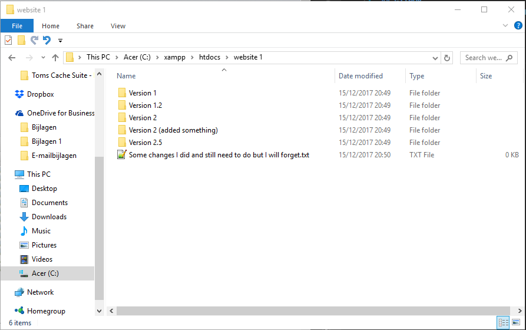
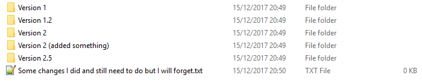

@title[Introduction]
## GITHUB
#### Version Control Repository Hosting

---
@title[Warm-Up]
## We've all been here

Do you see it?
+++

## We've all been here
@title[Warm-Up-Specific]

Multiple iterations, multiple versions, what changed?

Note:
Have multiple versions of the same thing, it's obvious on the time when you create it. After a while re-opening the folder you don't know what the difference is between the folders and how it all works.
+++

## We've all been here
@title[Warm-Up-Funny]

@James Franco from The Interview 
+++

## Then it comes
@title[Sharing-Development]

Note:
Sharing project, shame? Which version? Is it stable? 
---

##Problems
@title[Problems]

- multiple versions
- multiple contributors |
---
@title[Solution]
## Solution
##### Git & Github

---

@title[What-Is-Git]
## What is git?

##### git is an open source, distributed **version control system** designed for speed and efficiency
+++
@title[What-does-it-do]
## How does it work, in short?

- Branching 
- Merging     |
- Commiting   |
- Pull & Push |

---

@title[Demo]
## Let's dive in

@Octobiwan from GitHub 
